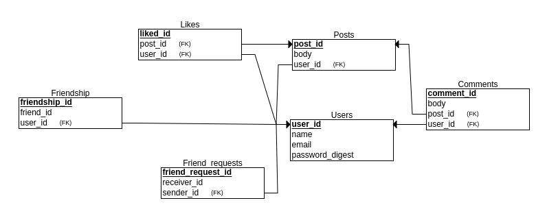

# README
# Building Facebook Project :
 In this project, we have to build an application whose functionalities are similar to that of Facebook.

 Built via pair programming by [me](https://github.com/zinagithub) and [Filipp Dmytriyenko](https://github.com/YellowPipe)
 
 **Prerequisites:**
 * Ruby
 * Ruby on Rails
 * SQL
 * Heroku
 * Git
 
 
 **To run the app**

 1. Clone this repo
 2. Run `bundle install`
 3. Run `rails s`
 4. Open `localhost:3000` in your browser
 
 **How we will create our social networking site?**
 We need to create three systems:
 * a system for managing users
 * a system for managing posts
 * a system for managing comments

**Main Model:**
Our main model will contain these three models

* Users model: To generate the user model we will use the gem Devise.

* Posts model: user can create many posts and share them
* Comments model: users can comment posts

**Relationships models**
* friendship: a user has many friendships
* likes: user can like a post or many posts
* freind_requests: Users can send a friend request to other users and the user must accept the friend request to become friends

**Controllers:**
* Users:
  * authentication with devise gem. Users must sign-in to see anything except the sign-in page
  * user can sign in with facebook (done with omniauth gem)
* Posts:
  * user can create posts
  * user can edit and delete his and only his posts
* Likes:
  * user can like and unlike posts without page refresh 
* Comments
  * user can comment on posts
  * user can edit and delete his and only his comments
* Friend requests:
  * user can send and accept and refuse friend requests without page refresh

**Views:**
* Users:
  * show: has profile information, gravatar, and user's posts
  * index - all users with a button to send a friend request
  * new
  * edit
* Posts:
  * index - displays posts from the current user and current user's friends
  * post always displays its content, the author, likes and comments
* Friend requests:
  * notification page with all requests user has pending 
